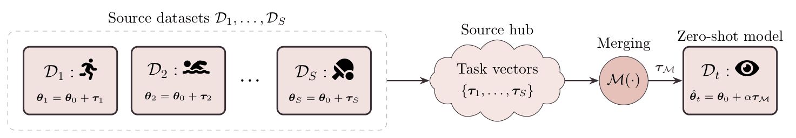

# Robust Zero-Shot Generalization for Open-Vocabulary Action Recognition via Task Arithmetic

This repository contains the code associated with the paper:

**Robust Zero-Shot Generalization for Open-Vocabulary Action Recognition via Task Arithmetic**

The project investigates how task arithmetic and model merging can improve zero-shot generalization in Open-Vocabulary Action Recognition (OVAR), without requiring target-domain fine-tuning.

<!-- Source paper: :contentReference[oaicite:0]{index=0} -->

---

## Overview

Open-Vocabulary Action Recognition aims to recognize human actions in videos by leveraging vision-language representations. Unlike closed-set action recognition, OVAR enables models to classify actions that were not explicitly seen during training by matching video representations with textual class descriptions.

However, robust performance in real-world scenarios often requires domain-specific fine-tuning. This can be expensive and problematic when target-domain data involves sensitive video recordings, privacy constraints, or regulatory limitations.

This project explores an alternative paradigm: instead of fine-tuning on the target domain, we reuse and combine knowledge from models already fine-tuned on publicly available action recognition datasets. The approach uses **task arithmetic** and **model merging** to construct a zero-shot model that generalizes better to held-out target domains.

The main idea is to:

* start from a common pre-trained Open-VCLIP model;
* fine-tune separate models on different public source datasets;
* extract task vectors from the fine-tuned models;
* merge these task vectors using different merging strategies;
* evaluate the resulting model on a held-out target dataset in a zero-shot setting.

The paper evaluates this approach in out-of-distribution settings and shows that merged models can outperform the original zero-shot baseline, especially when the target dataset is semantically distant from the pre-training domain.

---

## Method / Pipeline

The proposed method is based on task-vector extraction and parameter-space merging.

Given a pre-trained Open-VCLIP model with parameters `theta_0`, each source model is independently fine-tuned on a source dataset. For each fine-tuned model, a task vector is computed as the difference between the fine-tuned parameters and the original pre-trained parameters.

These task vectors are collected into a source hub and merged into a single update vector. The merged update is then added back to the pre-trained model, scaled by a coefficient `alpha`, to obtain the final zero-shot model.

The experimental protocol follows a leave-one-dataset-out setting:

* one dataset is held out as the target domain;
* the remaining datasets are used as source domains;
* models fine-tuned on the source datasets are merged;
* the merged model is evaluated on the held-out target dataset without using its training split.



The paper evaluates three merging strategies:

* **Task Arithmetic (TA)**: direct summation of task vectors;
* **Iso-C**: isotropic model merging with common and task-specific subspaces;
* **TSV-M**: task singular vector merging, based on layer-wise singular vector decomposition.

---

## Codebase

This project is built upon the official Open-VCLIP codebase:

```text
https://github.com/wengzejia1/Open-VCLIP.git
```

Open-VCLIP adapts CLIP to video recognition while preserving open-vocabulary capabilities. In this project, Open-VCLIP is used as the base architecture for extracting and merging task vectors in the video domain.

The code in this repository extends the original Open-VCLIP implementation with additional functionality for:

* task-vector extraction;
* model merging;
* leave-one-dataset-out zero-shot evaluation;
* comparison of different merging strategies;
* evaluation of robustness under out-of-distribution shifts.

---

## Installation

The dependencies and setup instructions are provided in:

```text
INSTALL.md
```

Please refer to that file for detailed installation instructions.

Example:

```bash
cat INSTALL.md
```

The environment follows the original Open-VCLIP installation procedure:

```text
https://github.com/wengzejia1/Open-VCLIP/blob/main/INSTALL.md
```

In short, create the Python environment, install the Open-VCLIP dependencies,
and then install any additional packages listed in this repository's
`INSTALL.md`. The previous Open-VCLIP installation note is kept in
`INSTALL_old.md` for reference.

---

## Datasets

The paper evaluates the proposed approach on four action recognition benchmarks:

| Dataset      | Number of Classes | Number of Videos | Description                                                           |
| ------------ | ----------------: | ---------------: | --------------------------------------------------------------------- |
| Kinetics-700 |               700 |          650,317 | Large-scale dataset of daily activities from YouTube videos           |
| UCF101       |               101 |           13,320 | Human action videos, including sports and human-object interactions   |
| HMDB51       |                51 |            6,766 | Cinematic and public video clips focused on facial and body movements |
| XD-Violence  |                 7 |            4,754 | Audio-visual benchmark for violent event recognition                  |

The experiments follow a leave-one-dataset-out protocol across these datasets.

Dataset download resources:

* Kinetics-700: `https://github.com/cvdfoundation/kinetics-dataset/blob/main/k700_2020_downloader.sh`
* UCF101: `https://github.com/open-mmlab/mmaction2/blob/main/tools/data/ucf101/download_videos.sh`
* HMDB51: `https://github.com/open-mmlab/mmaction2/blob/main/tools/data/hmdb51/download_videos.sh`
* XD-Violence: `https://roc-ng.github.io/XD-Violence/`

Each dataset is expected to expose an `annotations/` directory and a `videos/`
directory. A typical dataset layout is:

```text
<dataset_root>/
  annotations/
    <dataset>-cls2index.json
    <dataset>-index2cls.json
    train.csv
    val.csv
    test.csv
  videos/
    <class_name>/
      <video_1>
      <video_2>
      ...
```

The `videos/` directory contains one subdirectory per action class. The
subdirectory name is the class label of the videos inside it. The
`annotations/` directory contains one JSON mapping from class name to numeric
index, one JSON mapping from numeric index to class name, and one CSV file for
each split. Each split CSV contains the absolute paths of the videos belonging
to that split.

---

## Reproducing Experiments

The repository provides shell scripts for the main experimental steps used
in the leave-one-dataset-out protocol:

* source-model fine-tuning, through `scripts/training/`;
* checkpoint merging, through `scripts/merging/`;
* zero-shot and merged-model evaluation, through `scripts/evaluation/`.

Before running any script, edit the placeholder paths at the top of the file.
The scripts intentionally use generic placeholders such as
`/path/to/robust-ovar/repository`, `/path/to/datasets/root`,
`/path/to/checkpoints/root`, and `/path/to/openvclip/checkpoints/...` so that
they can be adapted to a local installation.

### Fine-Tuning Source Models

The training scripts are provided in:

```text
scripts/training/
```

They fine-tune Open-VCLIP from a base checkpoint on one source dataset. The
available scripts are:

```text
ft-HMDB51-reg0.sh
ft-K700-reg0.sh
ft-UCF101-reg0.sh
ft-xdviolence-reg0.sh
```

Before running a training script, edit:

* `ROOT`: path to this repository;
* `DATA`: dataset root directory;
* `CKPT`: output checkpoint root directory;
* `LOAD_CKPT_FILE`: Open-VCLIP checkpoint used to initialize fine-tuning;
* `INDEX2CLS_FILE`: dataset class mapping file;
* `TRAIN.CLIP_ORI_PATH`: local CLIP checkpoint path;
* `TRAIN.BATCH_SIZE` and `TEST.BATCH_SIZE`: batch sizes for training and
  evaluation.

Run a training script directly after editing the placeholders:

```bash
bash scripts/training/ft-HMDB51-reg0.sh
```

If you use a scheduler such as Slurm, keep the training script generic and call
it from your own job submission wrapper, for example:

```text
sbatch your_training_job.sh
```

Batch size is hardware-dependent. If training or evaluation runs out of GPU
memory, reduce `TRAIN.BATCH_SIZE` and `TEST.BATCH_SIZE`; ViT-L/14 usually
requires smaller values than ViT-B/16.

For ViT-L/14 fine-tuning, replace the ViT-B/16 config:

```text
configs/Kinetics/TemporalCLIP_vitb16_8x16_STAdapter.yaml
```

with:

```text
configs/Kinetics/TemporalCLIP_vitl14_8x16_STAdapter.yaml
```

The same backbone must be used consistently for `LOAD_CKPT_FILE`,
`TRAIN.CLIP_ORI_PATH`, and the config file.

### Checkpoint Merging

The main merging script is:

```bash
bash scripts/merging/merging.sh
```

This script wraps `model_merging.py`. By default, it saves only the merged task
delta, which is the recommended workflow for the evaluation scripts in this
repository. The active command produces an output file named:

```text
<MERGE_MODE>_delta.pyth
```

To use it, edit:

* `ROOT`: path to this repository;
* `BASE_CKPT_FILE`: Open-VCLIP base checkpoint used to compute the task vectors;
* `OUTPUT_DIR`: directory where the merged delta will be saved;
* `MERGE_MODE`: merging strategy, such as `mean`, `iso-c`, or `tsv-m`;
* `DEVICE`: `cpu` or `cuda`;
* `SOURCE_CKPTS`: list of fine-tuned source checkpoints to merge.

The script also contains a commented example for saving full merged checkpoints
for specific `alpha` values. In that case, the saved checkpoint already contains
the update:

```text
merged_checkpoint = base_checkpoint + alpha * merged_delta
```

For the default workflow used here, keep the delta-only command active and
select `alpha` later during evaluation.

### Zero-Shot Evaluation

The following scripts evaluate a checkpoint directly on a target dataset:

```text
scripts/evaluation/eval-on-HMDB51.sh
scripts/evaluation/eval-on-K700.sh
scripts/evaluation/eval-on-UCF101.sh
scripts/evaluation/eval-on-XDV.sh
```

Use these scripts to evaluate either an Open-VCLIP base checkpoint or another
checkpoint that can be loaded directly by Open-VCLIP. In each script, edit:

* `ROOT`: path to this repository;
* `DATA`: dataset root directory;
* `CKPT`: checkpoint/output root directory;
* `LOAD_CKPT_FILE`: checkpoint to evaluate;
* `INDEX2CLS_FILE`: dataset class mapping file;
* `CLIP_ORI_PATH`: local CLIP checkpoint path;
* `TEST.BATCH_SIZE`: batch size used during evaluation.

If `LOAD_CKPT_FILE` points to one of the Open-VCLIP base checkpoints, for
example:

```text
/path/to/openvclip/checkpoints/openvclip-b16/swa_2_22.pth
/path/to/openvclip/checkpoints/openvclip-l14/swa_2_22.pth
```

then the script performs the original zero-shot evaluation on the corresponding
target dataset.

For ViT-L/14 checkpoints, also replace the ViT-B/16 config:

```text
configs/Kinetics/TemporalCLIP_vitb16_8x16_STAdapter.yaml
```

with:

```text
configs/Kinetics/TemporalCLIP_vitl14_8x16_STAdapter.yaml
```

The same backbone must be used consistently for `LOAD_CKPT_FILE`,
`CLIP_ORI_PATH`, and the config file.

### Merged-Model Evaluation

The following scripts evaluate merged task deltas produced by
`scripts/merging/merging.sh`:

```text
scripts/evaluation/merge-eval-on-HMDB51.sh
scripts/evaluation/merge-eval-on-K700.sh
scripts/evaluation/merge-eval-on-UCF101.sh
scripts/evaluation/merge-eval-on-XD-Violence.sh
```

These scripts reconstruct the evaluated model at test time as:

```text
model = BASE_CKPT_FILE + MERGE_ALPHA * LOAD_CKPT_FILE
```

where `LOAD_CKPT_FILE` is the merged delta checkpoint, for example
`/path/to/merged/checkpoints/output/mean_delta.pyth`, and `BASE_CKPT_FILE` is
the Open-VCLIP base checkpoint used during task-vector extraction.

To evaluate different scaling coefficients, edit `MERGE_ALPHA` and rerun the
script. Logs are written to the path configured in `LOG_DIR`.

The provided scripts cover the main reproduction workflow: source fine-tuning,
checkpoint merging, and zero-shot or merged-model evaluation. Download the
required Open-VCLIP base checkpoints before running the scripts. Checkpoints
used in this project are provided in the Google Drive folder listed below, and
the original Open-VCLIP checkpoints are available from the authors at:

```text
https://drive.google.com/drive/folders/1VhwPFESkrr9Ed40yU5NEPIkrGIf6WQ9N
```

After setting the dataset, checkpoint, output, and config paths at the top of
each script, the scripts can be run directly with `bash`.

---

## Checkpoints

The checkpoints used for the experiments are available at the following Google Drive folder:

```text
https://drive.google.com/drive/folders/1V3y0fBDwk8sz61qi28yoW81WxOUTLwxK?usp=drive_link
```

By default, the scripts expect the ViT-B/16 Open-VCLIP base checkpoint to be
available inside the repository at:

```text
checkpoints/openvclip-b16/swa_2_22.pth
```

Place the checkpoint at this path before running the provided scripts. If you
prefer to store checkpoints elsewhere, update the corresponding checkpoint
paths in the training, merging, and evaluation scripts accordingly.

A detailed description of the checkpoints and their corresponding experimental
settings is provided through the Drive folder. Use the checkpoint names and
script paths to identify whether a checkpoint is pre-trained, fine-tuned,
merged, or a merged delta, and keep the selected backbone consistent across the
checkpoint, CLIP weights, and config file.

---

## Results

The paper reports results under a leave-one-dataset-out zero-shot evaluation protocol using two Open-VCLIP backbones:

* ViT-B/16
* ViT-L/14

The main findings are:

* Merging task vectors from multiple source datasets improves zero-shot generalization compared to the original zero-shot baseline.
* The gains are more evident when the target dataset is more out-of-distribution with respect to the pre-training domain.
* Advanced merging strategies such as Iso-C and TSV-M can provide additional benefits, especially for semantically distant target datasets.
* Increasing source diversity by using hyperparameter-diverse checkpoint pools further improves transferability and robustness.
* In-domain evaluation shows that merged models preserve a substantial amount of source-domain knowledge, although they generally remain below individually fine-tuned models.

### Leave-One-Dataset-Out Evaluation

The paper evaluates merged models on each held-out target dataset using task-specific checkpoints from the remaining source datasets. The reported metrics are:

* Top-1 accuracy
* Top-5 accuracy

### Leave-One-Dataset-Out Results

Comparative results under the leave-one-dataset-out protocol. Each target
dataset is evaluated using merged models constructed from task-specific
checkpoints fine-tuned on the remaining source domains.

| Backbone | Model | Strategy | K700 Top-1 | K700 Top-5 | UCF101 Top-1 | UCF101 Top-5 | HMDB51 Top-1 | HMDB51 Top-5 | XD-Violence Top-1 | XD-Violence Top-5 |
| --- | --- | --- | ---: | ---: | ---: | ---: | ---: | ---: | ---: | ---: |
| ViT-B/16 | Fine-tuned | - | 78.38 | 93.76 | 99.47 | 99.92 | 80.97 | 93.81 | 81.08 | 99.18 |
| ViT-B/16 | Zero-shot | - | 64.87 | 86.37 | 72.45 | 89.56 | 44.99 | 69.76 | 45.48 | 90.60 |
| ViT-B/16 | Merged | TA | 64.89 | **86.19** | 74.92 | 89.79 | 46.31 | 69.32 | 49.94 | 94.36 |
| ViT-B/16 | Merged | Iso-C | 64.85 | 86.08 | **75.53** | **90.09** | **46.76** | 69.76 | 47.00 | 93.30 |
| ViT-B/16 | Merged | TSV-M | **64.91** | 86.00 | 74.47 | 89.94 | 45.72 | **70.80** | **51.70** | **94.48** |
| ViT-L/14 | Fine-tuned | - | 82.77 | 95.47 | 99.77 | 100.00 | 83.92 | 95.87 | 81.90 | 99.41 |
| ViT-L/14 | Zero-shot | - | 72.48 | 90.18 | 79.73 | 93.60 | 46.76 | 71.98 | 47.00 | 91.77 |
| ViT-L/14 | Merged | TA | 72.45 | **90.31** | 81.61 | 93.32 | 47.79 | 72.86 | 55.93 | 93.30 |
| ViT-L/14 | Merged | Iso-C | **72.59** | 90.26 | **81.83** | 93.62 | **47.94** | 73.01 | **57.58** | **94.95** |
| ViT-L/14 | Merged | TSV-M | 72.50 | 90.27 | 81.08 | **93.84** | **47.94** | **73.60** | 56.52 | 94.48 |

### Hyperparameter-Diverse Merging on XD-Violence

Performance comparison of hyperparameter-diverse model merging on the
XD-Violence dataset. `Merged` and `All-8 Merged` denote aggregation with
different numbers of source checkpoints per dataset.

| Model | Strategy | ViT-B/16 Top-1 | ViT-B/16 Top-5 | ViT-L/14 Top-1 | ViT-L/14 Top-5 |
| --- | --- | ---: | ---: | ---: | ---: |
| Fine-tuned | - | 81.08 | 99.18 | 81.90 | 99.41 |
| Zero-shot | - | 45.48 | 90.60 | 47.00 | 91.77 |
| Merged | TA | 49.94 | 94.36 | 55.93 | 93.30 |
| Merged | Iso-C | 47.00 | 93.30 | **57.58** | **94.95** |
| Merged | TSV-M | **51.70** | **94.48** | 56.52 | 94.48 |
| All-8 Merged | TA | 52.17 | **94.71** | 61.34 | 95.30 |
| All-8 Merged | Iso-C | 47.00 | 92.13 | 62.98 | **96.36** |
| All-8 Merged | TSV-M | **53.70** | 94.24 | **63.57** | 95.53 |

### In-Domain Evaluation

In-domain evaluation across source datasets. Results show performance on each
dataset's test set for the unified model merged from all four task-specific
checkpoints.

| Backbone | Model | Strategy | K700 Top-1 | K700 Top-5 | UCF101 Top-1 | UCF101 Top-5 | HMDB51 Top-1 | HMDB51 Top-5 | XD-Violence Top-1 | XD-Violence Top-5 |
| --- | --- | --- | ---: | ---: | ---: | ---: | ---: | ---: | ---: | ---: |
| ViT-B/16 | Fine-tuned | - | 78.38 | 93.76 | 99.47 | 99.92 | 80.97 | 93.81 | 81.08 | 99.18 |
| ViT-B/16 | Zero-shot | - | 64.87 | 86.37 | 72.45 | 89.56 | 44.99 | 69.76 | 45.48 | 90.60 |
| ViT-B/16 | Merged | TA | 67.01 | 88.03 | 99.55 | 100.00 | 71.39 | 91.30 | 75.91 | 97.88 |
| ViT-B/16 | Merged | Iso-C | **68.96** | **89.87** | **99.77** | **100.00** | 72.42 | 91.15 | 73.33 | 98.35 |
| ViT-B/16 | Merged | TSV-M | 67.28 | 88.50 | **99.77** | **100.00** | **74.48** | **91.59** | **77.79** | **98.71** |
| ViT-L/14 | Fine-tuned | - | 82.77 | 95.47 | 99.77 | 100.00 | 83.92 | 95.87 | 81.90 | 99.41 |
| ViT-L/14 | Zero-shot | - | 72.48 | 90.18 | 79.73 | 93.60 | 46.76 | 71.98 | 47.00 | 91.77 |
| ViT-L/14 | Merged | TA | 79.45 | 94.60 | 98.05 | 99.85 | 71.09 | 91.30 | 80.96 | 98.94 |
| ViT-L/14 | Merged | Iso-C | **80.13** | **95.18** | 99.02 | 99.92 | 73.89 | 92.04 | 80.73 | **99.06** |
| ViT-L/14 | Merged | TSV-M | 80.11 | 94.85 | **99.77** | **100.00** | **74.50** | **93.36** | **81.20** | 98.71 |

---

## Citation

If you use this code, please cite the associated paper.

```bibtex
@article{TODO,
  title={Robust Zero-Shot Generalization for Open-Vocabulary Action Recognition via Task Arithmetic},
  author={TODO},
  year={TODO}
}
```

TODO: Replace this placeholder with the official BibTeX entry once the paper is published.

---

## Acknowledgements

This repository builds upon the Open-VCLIP codebase:

```text
https://github.com/wengzejia1/Open-VCLIP.git
```

We thank the Open-VCLIP authors for releasing their implementation and checkpoints, which provide the foundation for this project. Open-VCLIP is used as the base open-vocabulary video recognition model in our task arithmetic and model merging experiments.
